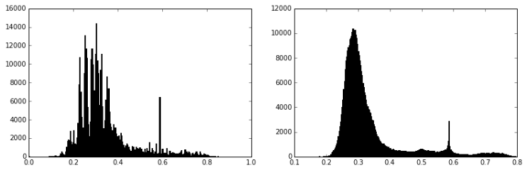

# Whalesniffer

Whalesniffer locates whales in a downsized version of [Kaggle's Right Whale Recognition challenge data set] using different types of segmentation strategies. The study was presented as the capstone project for the Digital Image Processing classes at Universidade Estadual Paulista "Júlio de Mesquita Filho" (UNESP), Sorocaba, Brazil. The final report and slides can be read [here](https://github.com/brunoarine/whalesniffer/tree/main/docs) (Portuguese only).

## Prerequisites

## Installation

Type the following in your shell or git prompt:

git clone https://github.com/brunoarine/whalesniffer.git

## Usage

Then open the folder and type:

python run.py

# Motivation

The North Atlantic Right Whale (_Eubalenae glacialis_) is currently represented by no more than 500 individuals globally. Thus, obtaining information about each individual's health and conditions is urgent so that preservation entities can protect them from extinction in the company of the scientific community. To track and monitor the population, experts photograph right whales by aerial survey and manually compared them with an online photo-identification catalog. The identification process takes time, making individual tracking for biological sampling, acoustic recording, and various relevant medical assessments difficult. Currently, only a few professionals can visually identify each whale present in the photos when they emerge. That sounds like an excellent job for machine learning! ;)

## Objective

In 2015, Kaggle and NOAA (National Oceanic and Atmospheric Administration) made available more than 8 gigabytes of images, free of charge, in a contest for the development of algorithms capable of individually identifying each whale specimen contained in the photos. The problem is that the images were not annotated.

So this project is an attempt at tackling the first step of an image recognition pipeline: **segmentation**. The study was presented as a capstone project for the Digital Image Processing class in my Environmental Sciences master's degree at Universidade Estadual Paulista "Júlio de Mesquita Filho" (UNESP).

## Used tools

The algorithms were written in Python 2.7.6 using the libraries Scikit-Image, OpenCV, and NumPy.

## Methodology

The pre and post processing steps for this work are shown in the flowchart below:

Four different ways of locating whales in the images were evaluated: contour search, thresholding, superpixel clustering, and histogram similarity search. The execution time of each algorithm was measured and taken into account in the final discussions.

### 1) Channel decomposition

The color space defined by the R, G and B channels is sensitive to light variation, as well as the presence of shadows and reflections in the photographed environment. The photos available for this work, however, were taken under different conditions of weather, time of day, lighting and angle of incidence of the sun. In addition to these natural factors, it should be noted that the camera is probably not the same, as some images have different resolutions from each other.

To ensure that there is a standard in the overall brightness and hue of the images, it was preferred to prioritize color spaces that are invariant to most of these factors. The table below lists the invariance quality of some of these color spaces.

_Invariance properties of individual channels in ascending order of invariance. The sign of "-" means fully variant, "+/-" partially invariant and "+" fully invariant to the corresponding property. _

During the tests, all models presented a satisfactory performance with the H and S channels of the HSV space, the a channel of the Lab space, and the Rn channel of the Normalized RGB space.

These results were probably because sea water is intensely bluish in relation to the whale, so these elements will appear differently in the H channel due to the difference in hue. In photos taken on sunny days, the water exhibits a considerably more intense coloration, producing more saturated pixels and consequently higher values ​​than the whale pixels in the S channel. The R channel is not always the best choice for targeting of the image, however, in certain cases the water region is almost completely black in this channel, as there are no red tones in the water. This same effect occurs in channel a of the Lab space, since this space separates red from blue in channels a and b respectively, with the advantage that variations in lighting remain isolated in channel L.

### 2) Removal of reflections and shadows in the waves

Depending on weather conditions and time of day, the sun's incident rays on the ripples of the water produce shadows and reflections that make the segmentation process difficult, especially in the stage where you try to find the edges of the whale in the image (see image below).

It is clear that these unwanted artifacts in the image differ from the whale's body in size and frequency; while there is only one whale per photo occupying a considerable region of the image, the shadows and streaks are numerous and thin. One way to eliminate them would be through band filtering in the image frequency domain, either by Fourier transform or wavelet. An example of what such a process would look like is shown in the figure below.

_2D Fourier transform simulation on a) an image with geometric shapes and interference lines, b) interference lines only, and c) geometric shapes only._

When applying the fast Fourier transform to a real photo and obtaining the power spectrum (squaring the real and imaginary part of the spectrum), the result is not intuitive enough for us to know which region of the spectrum to neutralize so that interferences could be eliminated.

<em>The Fourier transform of the image's S-channel does not immediately show clues as to how to eliminate ripples in the water.</em>

Thus, for the sake of simplicity, I decided to apply a medium filter to the selected channels before the execution of the segmentation processes, making sure that the mask used was larger than the size of the shadows and streaks that we would like to eliminate.

### 3) Vignette correction

Given the angle of incidence and nature of the photographic equipment used to acquire the images, there is a sharp shading close to the edges of the image in some of the photos. This shading is known as "vignette," easily seen especially in channel V (intensity) as a dark gradient. This phenomenon makes searching for a global threshold of image thresholding difficult since the histogram of intensity values ​​starts to bear an extra region formed by the shading pixels, as shown in the figure below.

<em>Example of thresholding by Otsu method in an image with vignette.</em>

Typically, vignette correction is done by subtracting the pixel values ​​from the original image by the pixel values from a white background image obtained with the same photographic equipment and under the same lighting conditions. If reference images are not available, the process of correcting the vignette can become a tad more complex. One method, for example, involves using a mixture of Gaussian models to determine the nature of each pixel and obtain the separation between the vignette and the image itself (CHEN et al., 2013).

However, for this work, I chose a significantly more straightforward solution. Using channel V as a reference, the image was blurred through 2D convolution with a Gaussian mask. Immediately, it is noticed that the region where there is shading stands out from the rest of the image, which has a "lighter" lighting.

I noticed experimentally that this Gaussian filter produced a more subtle gradient due to the nature of the mask, in contrast to the square mask of the medium filter, which creates distinct bands in the image.

Image correction takes place entirely on channel V, using the formula O = I - IxG + 128., where I is channel V, and G is the Gaussian convolution mask. An example of a result can be seen in the image below.

<em>a) image severely affected by the vignette effect, b) original image after applying the Gaussian filter, c) subtraction.</em>

It is noticed that the correction is not precise, but it considerably reduces the effect caused by the vignette during the thresholding process. Consequently, the image's contrast is visibly flattened but could be quickly normalized later.

### 4) Choosing the least troubled channel

As the threshold detection and contour detection algorithm uses only one channel as the input, I decided to create a method to choose the least troubled channel for the task automatically.

The definition of an image's disturbance is arbitrary and subject to different interpretations. What was desired, evaluating the different image channels, was to find the one in which the separation between foreground (whale) and background (water) elements was as less complex as possible.

There is no consensus on which would be the most objective measure to translate the degree of disturbance of an image. A first attempt to do so was based on second-order statistics calculated from the co-occurrence matrix: photographed objects tend to have a pixel-by-pixel correlation that, by definition, is not present in white noise. However, white noise does not necessarily disrupt the image segmentation process; above all, it is trivially removed with the application of a medium filter, for example. Thus, the correlation as a measure of disturbance is not appropriate in this case.

In the context of this work, I noticed that the whales in some images were sometimes in the middle of a large vortex of foam due to movement, sometimes partially submerged; in both cases, even without the presence of background noise in the image, the algorithm showed an unsatisfactory performance in the segmentation step.

_Water vapor expelled by the whale's spiracle confuses the thresholding algorithm._

Given this fact, I decided to simulate a raw edge detection in each candidate channel (as mentioned above, channels with larger invariance to the difference in illumination had higher priority) by calculating the image gradient. Once the edges are detected, the algorithm chooses the channel where the sum of the pixels of the image is smaller. In practical terms, this means selecting the channel that has the least interference.

### 5) Segmentation methods

#### 5.1) Edge detection method

After checking which channel is less troubled (among H, S and normalized R), the image gradient is calculated, then subjected to binarization using the Otsu method, as shown in the figure below.

_The most appropriate channel was selected, in this example being the H channel. Then it is filtered, its gradient is calculated, and then thresholded._

If the reference image chosen was the normalized R channel, it will be submitted to a different edge detection process. This is because the r channel is naturally more complex than the H or S channel when these are suitable for whale segmentation, that is, when they show precisely the animal's silhouette and nothing else. The same does not occur with the r channel, however more stable it is compared to either H or S. Therefore, the r channel is treated again with a median filter for secondary removal of smaller elements and then subjected to Canny edge detection filter. The Canny filter is currently seen as one of the most efficient algorithms for the task.

The resulting image will contain several probably non-continuous borders throughout image. They will be formed around various elements of the image, especially the whale itself and small artifacts produced by shadows, edges, foams, dirt, and other interferences. The correction of flaws in the lines that make up the edges of the image elements are corrected through the morphological method of closing the threshold image.

_The dilation followed by erosion of the elements of the image causes gaps present between one point and another to be connected, allowing the filling of the formed figure._

After correcting the flaws in the contours and making them continuous lines, filling the shapes becomes trivial and, regardless of the method used, the final result will be the same. In the case of this work, the filling algorithm consists of invading the complementary shape of the image through the dilation process. Holes are not connected to edges and therefore are not invaded. The result is the complementary subset of the invaded region.

#### 5.2) Thresholding

Unlike the previous method, in this case the image is segmented directly from the selected channel, without going through the edge detection process. Based on the hypothesis that there are background and front elements separable in the image only by the value of the pixels, the method consists in finding the optimal threshold for the maximum separation to occur. Tests were carried out with the a channel of the Lab space and the H channel of the HSV space, both with excellent invariant properties. The results showed that among them, channel a is the most suitable for separating the whale from the bottom element.

Thresholding benefits if we transform pixel values from 8-bit integers to 32-bit decimals, and then apply a fading filter such as the mean or Gaussian filter. This has the role of interpolating the discrete values of pixels, improving the performance of the thresholding method algorithm.

_On the right, histogram of the original image. On the left, the histogram of the image after a Gaussian filter with a 3-pixel size kernel. Note how the shapes of Gaussian peaks are better distinguished after fading._

The Otsu method for calculating the threshold, as mentioned, assumes that the image contains two classes of pixels, whose histogram takes the form of a bimodal distribution. The algorithm performs an exhaustive search so that the intraclass variance is minimized, that is, the weighted sum of the variances of the two classes (OTSU, 1979).

However, Otsu's method is incompatible with certain images whose histograms are multimodal distributions. That happens because of the presence of four distinct elements in the image: the water, the whale, the shadows, and the reflections that could not be removed in the pre-processing, either because the pixel values ​​are very close to those of the whale, either because the size of the impurities in the photo is larger than the mask used to filter them.

This problem can be overcome by generalizing the Otsu method to more than one threshold, known as the Multilevel Otsu Method. Liu and Yu (2009) showed that the multilevel Otsu method is fully compatible with clustering methods, some of which are more efficient from a computational point of view. Therefore, instead of the Otsu method, the segmentation of the channel was done using a Gaussian mixture model. This is a probabilistic model, which assumes that the data distribution is formed by mixing a finite number of Gaussian distributions of unknown parameters. Since the histogram of the pixel values ​​of each main element of the image should follow approximately a normal distribution, the Gaussian mixture model seemed to be more appropriate than other clustering methods, such as the k-means method, for example, which assumes that the calculated sections have equivalent dimensions.

_Examples of how the histogram is decomposed in the two Gaussians (left) model, by the bimodal Otsu method, and four Gaussians (right), by the Gaussian mixture model. The threshold was estimated at 0.40 and 0.57, respectively._

For the Gaussian mixture model, the Gaussian curves representing the two most intense pixel groups were taken as a reference. Due to whales excel in the channel to form lighter than all the other picture elements, the threshold is calculated as the highest point of intersection of these two groups (which may be approximated as the mean of the centroids of each of the groups). The difference in the two threshold modes can be seen in the figure below.

_Original image, threshold by the bimodal model and the multimodal model, respectively._

The multimodal model allows the calculation of a more precise threshold for separating the whale from the rest of the image. It is even noted that the threshold was such that the water vapor expelled by the whale was left out.

#### 5.3) Superpixel grouping method

The idea of ​​this segmentation method was first proposed by Ren and Malik (2003) and popularized by Achanta et al. (2010) through the algorithm called SLIC ( Simple Linear Iterative Clustering ). This algorithm performs a super-segmentation of the image using the k-means model and using all the pixel values ​​of all channels in the Lab color space as a reference.

_Example of superpixels creation using the SLIC algorithm._

The most similar pixels are grouped in a "superpixel" and may or may not be connected, according to the parameters imposed on the algorithm. Because it uses k-averages, this superpixel creation algorithm is the most computationally efficient (ACHANTA et al., 2012). However, even so, the execution time was too high to apply this segmentation method in 100 test images. Reducing the image to 20% of the original size has reduced the runtime without significantly impairing efficiency.

After creating the superpixels, they are grouped into three larger groups using an agglomerative clustering algorithm. They perform a hierarchical clustering of the superpixels based on the Euclidean distance. This step is suggested by Pantofaru and Herbert (2005), whose work uses a superpixel algorithm called "mean-shift," predecessor of SLIC.

_ number of superpixels reduced by agglomerative clustering (left) and selection of the cluster most compatible with the illumination of the original image (right)_

After reducing the number of clusters, the most relevant cluster among the three estimated is selected. In the vast majority of the investigated photos, the whale's body has pixels of greater value in the R channel than in the other channels. Converting the RGB space to normalized RGB, to ensure that the selection method is standardized in different illuminations, the segment whose pixel ratio of the normalized R channel in relation to the rest of the image is the largest is selected (Figure 16 ).

#### 5.4) Histogram similarity

This method is simpler than the previous methods, but more robust in relation to features that vary from one image to another. This algorithm is based on two facts from the nature of the photos in question: a) the whale occupies a small area of the image and b) most of the image, which is occupied by water, is practically uniform.

Based on these two principles, the algorithm divides the image into four windows and calculates the histogram of each one in the HSV space, since this is partially invariant to different lighting conditions, but returns differentiable histograms between regions. If one of them has a histogram statistically different from the histogram that generated these 4 windows (determined by the correlation coefficient between the values of each band), this window is marked in a mask and then it subdivides the window into 4 more windows and so on.

_Example of a recursive search for regions with different histograms compared to the entire image histogram._

Thanks to the recursiveness of the algorithm, scanning becomes more efficient, as the computation of histograms focuses on regions (and sub-regions) that have only pixels of interest, rather than background pixels.

### 6) Post-processing

For all the segmentation methods used, the next step is to eliminate small segments through the morphological opening operation (in which erosion is carried out, followed by the dilation of the image).

More than one segment can remain in the resulting image in this step. Assuming that the whale is the largest front element in all photos, filter it so that only the largest segment remains. The detection and calculation of each spot present in the image is done through growing regions. In this process, the binary image is scanned until a pixel of the desired value is found (in this case, 1). From this point on, the image is scanned bilaterally to estimate how far this segment and value 1 propagates. After scanning the entire continuous range of values ​​one and locating the extent of the stain, it has the area counted and its pixels removed from the image. The algorithm then continues its search from the previous point.

## Results and discussion

There is no consensus in the computer vision community on the best way to evaluate segmentations (ÖZDEMIR et al., 2010). The list of available metrics is as extensive as research groups in the area and their pros and cons. Therefore, common sense should dictate the most relevant metric for the type of task the job wants to evaluate. It would not have practical significance for this work, for example, to use the "false-negative rate." How to estimate the number of false negatives if all the images in the test set are positive (that is, they have at least one whale)?

The metric chosen to evaluate the performance of the algorithms in this work was the "overlap," as defined by the iou Visual Object Classification Challenge, which is a worldwide competition of computer vision algorithms considered a reference (UIJILINGS et al., 2013). The overlay formula is given by

$$ O = \frac{\text{area of overlap}}{\text{area of union}} $$

The overlap may vary r between 0 and 1, where a value greater than 0.5 is deemed "detected." The above formula ensures that the algorithms are rewarded the closer the whale's estimated rectangle approaches the true rectangle. In contrast, the score is impaired if the whale is still within the estimated rectangle, but the estimated rectangle is excessively larger than the actual rectangle. Likewise, estimated rectangles that are much smaller than the real one will also be penalized.

Although the superposition metric proposed in iou VOC seems sensible in the scope of this work, the comparison with algorithms from other works is still ambiguous, even if they use the same metric. One must consider the quantity and nature of the images in the test set and how "permissible" was the person who labeled in each photo the actual position of the object to be detected. In the case of the whales in this work, the actual locations were marked, taking into account all the humanly visible parts of the cetaceans, even the submerged portion almost indistinct with the naked eye. Other authors, however, could prefer the delimitation of the whales in the photos only in the part out of the water and of easy observation. Still, others might like to delimit the whale region by leaving a certain amount of slack within the rectangle. Therefore, the statistics in Table 2 are intended for intra-study comparison only.

The performance of Histogram Similarity was remarkable, taking into account the simplicity of the concept. The performance of the segmentation by superpixels was not as good as expected since many other works use it successfully. It is believed to be a matter of adjustments to the algorithm.

The threshold and contour detection methods also showed excellent results, given the variety of light conditions in each image. According to the figure below, the choice of color space proved to have a direct relationship with the final performance of the algorithm, according to the figure below.

_Precision of each thresholding technique, made with the Otsu method and Gaussian mixing model in channels a, H, Rn and combinations of these._

According to the results of different threshold settings, it is clear that the channel used as a reference is even more critical than the histogram threshold method (Otsu or GMM).

The blue rectangles indicate the area where the whale is present. The red rectangles indicate the two worst classifications by the algorithms, and the green rectangles indicate the two best classifications. It is noted that clouds of steam were the element that most affected all performances, followed by luminous conditions where the whales do not stand out from the bottom.

### Comparison with other works

The most outstanding work concerning remote counting of right whales was done by Fretwell et al. (201 4 ), based on the "coastal" and "near-infrared" bands of the WorldView2 satellite, whose sensor has a maximum resolution of 0.5 m per pixel. The authors experimented with four different segmentation methods on their images obtained from the high-resolution satellite. The number of correct answers, the number of failures and the number of false positives, and the number of false negatives were estimated. The tests were carried out on several concatenated satellite images, in which the authors manually identified 91 right whales. It was not specified how the arrangements and to identify failures were recorded in the statistics. The labor statistics are summarized under the precision metric.

As the present work does not have a relationship of true negatives, because the test photos always contain at least one individual, the statistics could not be summarized by the F1 metric, as is usual in works with classifiers.

_Precision values obtained by the algorithms of this study and the study by Fretwell et al. (2014). The bold lines represent the best performances of both._

The experiments by Fretwell et al. (2014) show that the best performance obtained in that study was through the thresholding of Worldview2 panchromatic images. However, the authors claim that this method with exceptional performance was performed "with the user's assistance" - that is, iteratively adjusting a threshold value that maximizes its accuracy, unlike this work, whose algorithms were executed in an unsupervised way.

The authors also mention that the region chosen for monitoring provided images with calm, cloud-free water. These two characteristics facilitate the process of searching for maritime elements (ABILEAH, 2002). In previous works, the reflections and shadows produced by the incidence of sunlight on the waves make the segmentation of whales an impractical task.

As the present work contained such elements in several images and, taking into account that the algorithms acted in an unsupervised way, the obtained performance can be considered reasonable.

## Conclusions

The field of computer vision can bring good results to the most diverse areas of knowledge. This work succinctly exemplifies this statement. The extensive work of locating and labeling whales in aerial images can be automated with an accuracy of up to 78%, using only basic statistical methods for segmentation and thorough work of pre-processing the images. We must also keep in mind that part of the unsatisfactory results is due to the considerable variance of properties of the photos used, which showed different forms and intensities of lighting, water texture caused by the winds, distances between the photographic sensor and the whales, outbreaks, photographic equipment, angles and positions of the whales, portions of the whales that remained submerged, etc.

The precision obtained in this study can perhaps be improved through more sophisticated segmentation methods, combined with a rectifier capable of understanding the shape of the segment and estimating the probability of it being a whale or just impurity in the image. The method created by Uijilings et al. (2013) seems quite promising for the problem due to its high computational efficiency in segmentation, leaving room for robust classifiers such as SVM or convolution neural networks to correctly classify segments.

## References

ABILEAH, R. Marine mammal census using space satellite imagery. U. S. Navy Journal of Underwater Acoustics, v. 52, n. 3, jul. 2002.

ACHANTA, R.; SHAJI, A.; SMITH, K.; LUCCHI, A.; FUA, P.; SÜSSTRUNK, S. Slic superpixels. [s.l: s.n.].

ACHANTA, R.; SHAJI, A.; SMITH, K.; LUCCHI, A.; FUA, P.; SÜSSTRUNK, S. SLIC Superpixels Compared to State-of-the-Art Superpixel Methods. IEEE Transactions on Pattern Analysis and Machine Intelligence, v. 34, n. 11, p. 2274–2282, nov. 2012.

BRILLANT, S. W.; VANDERLAAN, A. S.; RANGELEY, R. W.; TAGGART, C. T. Quantitative estimates of the movement and distribution of North Atlantic right whales along the northeast coast of North America. Endangered Species Research, v. 27, p. 141–154, 2015.

CHEN, S. Y.; DAI, S. G.; MU, P. A. Correction of CCD Camera Lens Vignetting. Applied Mechanics and Materials, v. 373-375, p. 603–607, ago. 2013.

EBERHARDT, L. L.; CHAPMAN, D. G.; GILBERT, J. R. A review of marine mammal census methods. Wildlife Monographs, v. 63, p. 3–46, 1979.

FINN, C.; DUYCK, J.; HUTCHEON, A.; VERA, P.; SALAS, J.; RAVELA, S. Relevance feedback in biometric retrieval of animal photographs. In: Pattern Recognition. [s.l.] Springer, 2014. p. 281–290.

FRETWELL, P. T.; STANILAND, I. J.; FORCADA, J. Whales from Space: Counting Southern Right Whales by Satellite. PLoS ONE, v. 9, n. 2, p. e88655, 12 fev. 2014.

FUJIWARA, M.; CASWELL, H. Demography of the endangered North Atlantic right whale. Nature, v. 414, n. 6863, p. 537–541, 2001.

GILLESPIE, D. Detection and classification of right whale calls using an “edge” detector operating on a smoothed spectrogram. Canadian Acoustics, v. 32, n. 2, p. 39–47, 1 jun. 2004.

KAGGLE. Description - Right Whale Recognition | Kaggle. Disponível em: <https://www.kaggle.com/c/noaa-right-whale-recognition>. Acesso em: 17 nov. 2015.
KRAUS, S. D.; BROWN, M. W.; CASWELL, H.; CLARK, C. W.; FUJIWARA, M.; HAMILTON, P. K.; KENNEY, R. D.; KNOWLTON, A. R.; LANDRY, S.; MAYO, C. A. North Atlantic right whales in crisis. SCIENCE-NEW YORK THEN WASHINGTON-, v. 5734, p. 561, 2005.

KRAUS, S. D.; MOORE, K. E.; PRICE, C. A.; CRONE, M. J.; WATKINS, W. A.; WINN, H. E.; PRESCOTT, J. H. The use of photographs to identify individual North Atlantic right whales (Eubalaena glacialis). Rep. int. Whal. Commn, p. 145–51, 1986.

LAIST, D. W.; KNOWLTON, A. R.; PENDLETON, D. Effectiveness of mandatory vessel speed limits for protecting North Atlantic right whales. Endangered Species Research, v. 23, p. 133–147, 2014.

LIU, D.; YU, J. Otsu Method and K-means. In: Ninth International Conference on Hybrid Intelligent Systems, 2009. HIS ’09, Anais... In: NINTH INTERNATIONAL CONFERENCE ON HYBRID INTELLIGENT SYSTEMS, 2009. HIS ’09. ago. 2009.

MACDONALD, D. (ed.). The encyclopedia of mammals. 2 edition ed. Oxford ; New York: OUP Oxford, 2009.

MATE, B. R.; NIEUKIRK, S. L.; KRAUS, S. D. Satellite-Monitored Movements of the Northern Right Whale. The Journal of Wildlife Management, v. 61, n. 4, p. 1393–1405, 1997.

NEW ENGLAND AQUARIUM. Right Whale Callosity Pattern Identification. Disponível em: <http://www.neaq.org/conservation_and_research/projects/endangered_species_habitats/right_whale_research/right_whale_projects/monitoring_individuals_and_family_trees/identifying_with_photographs/how_it_works/callosity_patterns.php>. Acesso em: 17 nov. 2015.

NOAA. Automatic Whale Detector, Version 1.0 :: NOAA Fisheries. Disponível em: <http://www.fisheries.noaa.gov/stories/2015/02/gray_whale_survey_thermal_imaging.html>. Acesso em: 17 nov. 2015.

OLIPHANT, T. E. Python for scientific computing. Computing in Science & Engineering, v. 9, n. 3, p. 10–20, 2007.

OTSU, N. A Threshold Selection Method from Gray-Level Histograms. IEEE Transactions on Systems, Man, and Cybernetics, v. 9, n. 1, p. 62–66, 1979.

ÖZDEMIR, B.; AKSOY, S.; ECKERT, S.; PESARESI, M.; EHRLICH, D. Performance measures for object detection evaluation. Pattern Recognition Letters, v. 31, n. 10, p. 1128–1137, 2010.

REN, X.; MALIK, J. Learning a classification model for segmentation. In: Computer Vision, 2003. Proceedings. Ninth IEEE International Conference on, Anais...IEEE, 2003.

UIJLINGS, J. R.; VAN DE SANDE, K. E.; GEVERS, T.; SMEULDERS, A. W. Selective search for object recognition. International journal of computer vision, v. 104, n. 2, p. 154–171, 2013.

VAN DER WALT, S.; SCHÖNBERGER, J. L.; NUNEZ-IGLESIAS, J.; BOULOGNE, F.; WARNER, J. D.; YAGER, N.; GOUILLART, E.; YU, T. scikit-image: image processing in Python. PeerJ, v. 2, p. e453, 2014.

YACK, T. M.; BARLOW, J.; ROCH, M. A.; KLINCK, H.; MARTIN, S.; MELLINGER, D. K.; GILLESPIE, D. Comparison of beaked whale detection algorithms. Applied Acoustics, Proceedings of the 4th International Workshop on Detection, Classification and Localization of Marine Mammals Using Passive Acoustics and 1st International Workshop on Density Estimation of Marine Mammals Using Passive Acoustics. v. 71, n. 11, p. 1043–1049, nov. 2010.

ZERBINI, A. N.; BAUMGARTNER, M. F.; KENNEDY, A. S.; RONE, B. K.; WADE, P. R.; CLAPHAM, P. J. Space use patterns of the endangered North Pacific right whale Eubalaena japonica in the Bering Sea. 2015.
